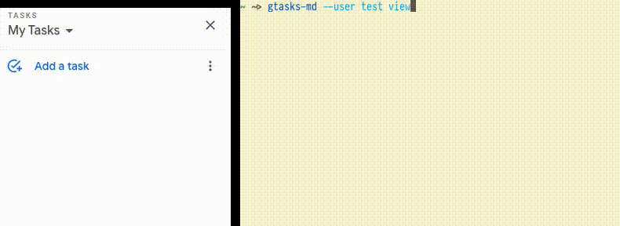

# gtasks-md

[Google Tasks](https://mail.google.com/tasks/canvas) is a Google Workspace tool
that has the following advantages:

-   It has great integration with Google Calendar.
-   There are mobile apps developed by Google for Android and iOS.
-   It is pretty straightforward to use, there is no feature creep.

All great, this works pretty well for shopping groceries or something, but what
if it was to be suitable for tracking more advanced tasks (e.g. work related)?
It is possible to add some text as note to a task but this is very limited and
not very convenient to use on desktop computer.

The idea that this project represents is declarative approach to task
management. It provides an interface for manipulating Google Tasks via
Markdown[^1]. See the following demo:



## Supported operations

All commands support `--user` flag which allows multi-user usage.

### auth

``` console
gtasks-md auth ./credentials.json
```

In order to run gtasks-md it is needed first to obtain API credentials. This can
be achieved with the following steps[^2]:

1.  Create a new project in [GCP](https://cloud.google.com/) and go to [Google
    APIs](https://console.developers.google.com/apis/).

2.  Click `ENABLE APIS AND SERVICES` add `Google Tasks API`.

3.  Go to [Google APIs](https://console.developers.google.com/apis/) and click
    `OAuth consent screen` from the sidebar.

    -   Choose `External` (Available to any user with a Google Account.) and
        click `CREATE`.
    -   Input your favorite name to `Application name`. In the
        `Scopes for Google APIs` section, click `Add scope` and add
        `Task API ../auth/tasks`.
    -   Click `Save` (DO NOT `Submit for verification`).

4.  Go to the `Credentials` page from the sidebar.

    -   Create a new `OAuth client ID`. Select `Desktop application` for the
        application type.
    -   Download the credentials as `JSON` file.
    -   Run `gtasks-md auth` command with that file as argument.

In case of troubles consult [OAuth client ID
credentials](https://developers.google.com/workspace/guides/create-credentials#oauth-client-id)
creation documentation for a Desktop app.

### view

``` console
$ gtasks-md view
# # TODO
#
# ## My Tasks
#
# 1.  [ ] Task 1
#
#     Example note 1.
#
# 2.  [ ] Task 2
#
#     1.  [ ] SubTask 1
#
#         This is another useful note.
#
#     2.  [ ] SubTask 2
```

Downloads all task lists, parses them to Markdown format and prints to stdout.

### edit

``` console
gtasks-md edit
```

Begins with the same operations as `gtasks-md view` but later opens the text in
an editor. After user is done with entering changes, the resulting file is
parsed back to task lists and local state is reconciled with server state.

### reconcile

``` console
gtasks-md reconcile ./tasks.md
```

Similar to `gtasks-md edit` but instead of editing the Markdown it sources the
provided file as local state and reconciles it.

### rollback

``` console
gtasks-md rollback
```

Rolls back the server state to the most recent locally backuped state. Useful if
something goes wrong.

## Setup

Until the first release is cut the suggested way to run the tool is via the
`runner.py` script. The setup may be done with the following steps:

### Ubuntu

``` sh
# 1. Install binary dependencies
$ sudo apt install pandoc pip
# 2. Install Python dependencies
$ pip install -r requirements.txt
# 3. Run the runner.py
$ ./runner.py --help
```

### NixOS (or when using Nix)

``` sh
nix-shell
./runner.py --help
```

[^1]: Subset of [Pandoc's
    Markdown](https://pandoc.org/MANUAL.html#pandocs-markdown) to be exact

[^2]: Shamelessly stolen from
    [calendar.vim](https://github.com/itchyny/calendar.vim#important-notice)
